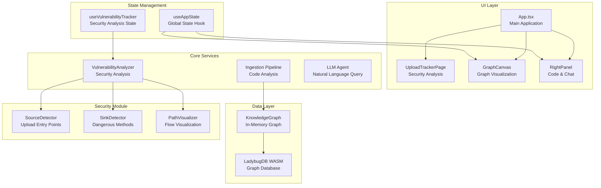

# Architecture

## System Overview

GitNexus Web is a browser-based application that analyzes codebases and enables interactive exploration through knowledge graphs with AI-powered natural language querying.

## Architecture Diagram

## Upload Vulnerability Tracker

### Overview

The Upload Vulnerability Tracker analyzes Java web applications to discover potential file upload vulnerabilities by tracing data flow paths from entry points (sources) to dangerous file handling methods (sinks).

### Source Detection

Sources are identified by:

- **Annotations**: `@RequestMapping`, `@GetMapping`, `@PostMapping`, `@PutMapping`, `@DeleteMapping`, `@PatchMapping`
- **Keywords**: `upload`, `uploadFile`, `doUpload`, `handleUpload`, `importFile`, `attach`, `postFile`, `fileUpload`

### Sink Detection

Sinks are categorized into:

| Category | Methods |
|----------|---------|
| FILE_WRITE | `FileOutputStream.write`, `Files.write`, `FileWriter.write`, `BufferedWriter.write`, `writeBytes`, `transferTo` |
| RUNTIME_EXEC | `Runtime.exec`, `ProcessBuilder.start`, `ClassLoader.defineClass`, `ScriptEngine.eval` |
| DESERIALIZATION | `ObjectInputStream.readObject`, `XMLDecoder.readObject`, `Yaml.load`, `JSON.parse` |

### Path Discovery

Path discovery uses BFS (Breadth-First Search) to find connections:

1. Start from detected sources
2. Traverse CALLS relationships
3. Find paths to detected sinks
4. Rank by confidence and depth

### Visualization

The tracker provides two visualization modes:

1. **Mermaid Flowchart**: Shows step-by-step call paths
2. **Graph Highlighting**: Highlights nodes and edges on the main graph

### Key Files

| File | Purpose |
|------|---------|
| `src/core/security/types.ts` | Data models and constants |
| `src/core/security/source-detector.ts` | Source identification logic |
| `src/core/security/sink-detector.ts` | Sink identification logic |
| `src/core/security/path-visualizer.ts` | Mermaid generation and highlighting |
| `src/core/security/vulnerability-analyzer.ts` | Path discovery orchestration |
| `src/hooks/useVulnerabilityTracker.ts` | React state management |
| `src/pages/UploadTrackerPage.tsx` | UI component |

## Data Flow

```mermaid
sequenceDiagram
    participant User
    participant UI as UploadTrackerPage
    participant Hook as useVulnerabilityTracker
    participant Analyzer as VulnerabilityAnalyzer
    participant Graph as KnowledgeGraph
    
    User->>UI: Configure analysis
    UI->>Hook: analyze()
    Hook->>Analyzer: findPaths()
    Analyzer->>Graph: Query nodes
    Analyzer-->>Hook: DataFlowPath[]
    Hook-->>UI: Render visualization
```

## Technology Stack

| Component | Technology |
|-----------|------------|
| UI Framework | React 18 |
| Build Tool | Vite |
| Styling | TailwindCSS 4 |
| Graph Rendering | Sigma.js + Graphology |
| Database | LadybugDB (WASM) |
| Diagrams | Mermaid |
| AI Integration | LangChain |
