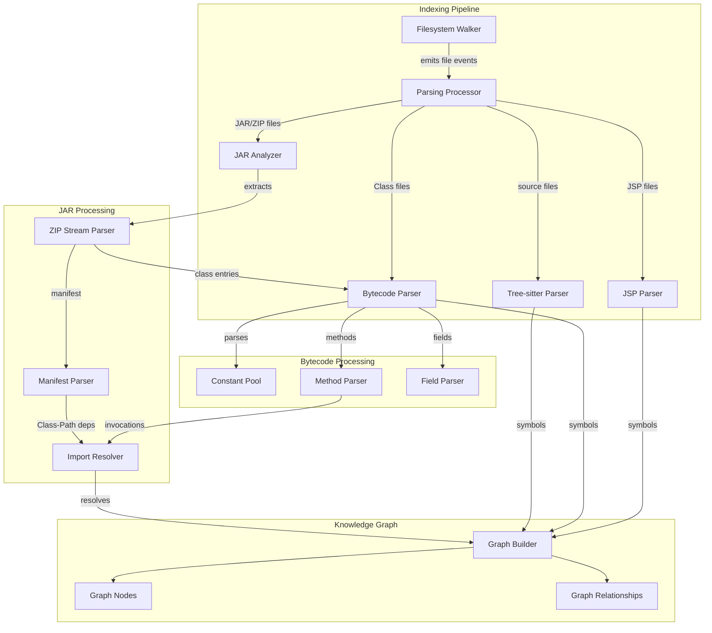

# Technical Design Document - Java Binary Indexing

Feature Name: java-binary-indexing
Updated: 2026-03-28

## Description

本设计文档描述如何为 GitNexus 添加 Java 二进制文件（JAR、CLASS、JSP）的索引和调用关系分析功能。该功能扩展现有的基于 Tree-sitter 的解析管道，添加对 JVM 字节码和 JSP 模板的解析能力。

## Architecture



## Components and Interfaces

### 1. JAR Analyzer (`jar-analyzer.ts`)

负责解压和解析 JAR 文件结构。

**职责：**
- 流式解压 ZIP/JAR 文件
- 识别并提取 MANIFEST.MF
- 遍历内部 class 文件条目
- 协调 class 文件的解析

**接口：**
```typescript
interface JarAnalyzer {
  analyze(jarPath: string, options: JarIndexOptions): AsyncIterable<JarEntry>;
  extractManifest(jarPath: string): Promise<ManifestInfo>;
}

interface JarIndexOptions {
  extractInnerClasses: boolean;      // 默认: true
  maxJarSize: number;                // 默认: 100MB
  recursiveNestedJars: boolean;      // 默认: false
}

interface JarEntry {
  type: 'class' | 'manifest' | 'resource';
  path: string;
  data: Buffer | string;
}
```

### 2. Bytecode Parser (`bytecode-parser.ts`)

负责解析 Java class 文件格式（JVM Specification）。

**职责：**
- 解析 class 文件头部（magic, version）
- 提取常量池所有条目
- 解析类/接口访问标志和继承信息
- 解析字段表和方法表
- 分析方法字节码指令
- 提取 try-catch 块和局部变量表

**接口：**
```typescript
interface BytecodeParser {
  parse(buffer: Buffer): ClassFile;
  analyzeMethod(bytecode: Buffer, constantPool: ConstantPoolEntry[]): MethodAnalysis;
}

interface ClassFile {
  version: { major: number; minor: number };
  accessFlags: AccessFlags;
  thisClass: string;           // 完全限定名
  superClass: string | null;
  interfaces: string[];
  constantPool: ConstantPoolEntry[];
  fields: FieldInfo[];
  methods: MethodInfo[];
  attributes: Attribute[];
}

interface MethodAnalysis {
  calls: CallSite[];
  fieldAccesses: FieldAccess[];
  isConstructor: boolean;
  isStaticInitializer: boolean;
}

interface CallSite {
  opcode: OpCode;
  owner: string;              // 被调用者的类
  name: string;                // 方法名
  descriptor: string;         // 方法描述符
  lineNumber: number;
  isDynamic: boolean;
}
```

### 3. JSP Parser (`jsp-parser.ts`)

负责解析 JSP 文件中的 HTML 结构和 Java 代码。

**职责：**
- 提取 HTML 结构（form、link、script）
- 识别 JSP 指令（page、include、taglib）
- 提取 scriptlet（<% %>）、expression（<%= %>）、declaration（<%! %>）中的 Java 代码
- 解析 Java 代码的 import 语句和方法调用
- 处理 EL 表达式（${}）

**接口：**
```typescript
interface JspParser {
  parse(content: string, filePath: string): JspFile;
}

interface JspFile {
  path: string;
  imports: ImportStatement[];
  declarations: JspCodeBlock[];    // <%! %>
  scriptlets: JspCodeBlock[];       // <% %>
  expressions: JspCodeBlock[];     // <%= %>
  htmlElements: HtmlElement[];
  elExpressions: string[];
}

interface JspCodeBlock {
  type: 'declaration' | 'scriptlet' | 'expression';
  content: string;
  lineNumber: number;
  ast: JavaScriptAST | null;       // 可选的 AST
}
```

### 4. Import Resolver (`import-resolver.ts`)

负责解析符号引用，建立 IMPORTS/CALLS 关系。

**职责：**
- 接收来自 bytecode 和 jsp parser 的符号引用
- 在当前文件的常量池/classpath 中查找符号定义
- 跨 JAR 边界解析类引用
- 区分静态调用和实例调用

**解析策略：**
```typescript
enum ResolutionTier {
  SameFile = 1,         // 同文件内解析
  SameJar = 2,          // 同 JAR 内解析
  ImportedJar = 3,      // 通过 import 导入的 JAR
  ClassPath = 4,        // 全局 classpath
}
```

### 5. Graph Builder Extensions

扩展现有的 `graph.ts` 以支持二进制文件的节点和关系。

**新增节点类型：**
```typescript
type BinaryNodeLabel = 'Jar' | 'BytecodeClass' | 'BytecodeMethod' | 'BytecodeField';

interface JarNode extends GraphNode {
  label: 'Jar';
  properties: {
    name: string;
    manifestMainClass: string | null;
    classPath: string[];
    entries: number;
  };
}

interface BytecodeClassNode extends GraphNode {
  label: 'BytecodeClass';
  properties: {
    name: string;           // 完全限定名
    package: string;
    isInterface: boolean;
    accessFlags: string[];
    version: string;
    jarId: string | null;  // 所属 JAR
  };
}

interface BytecodeMethodNode extends GraphNode {
  label: 'BytecodeMethod';
  properties: {
    name: string;
    descriptor: string;    // JVM 类型描述符
    parameterTypes: string[];
    returnType: string;
    accessFlags: string[];
    maxStack: number;
    maxLocals: number;
    bytecodeLength: number;
  };
}
```

**新增关系类型：**
```typescript
type BinaryRelationshipType = 
  | 'CONTAINS_CLASS'    // JAR -> BytecodeClass
  | 'BYTECODE_CALLS'    // BytecodeMethod -> BytecodeMethod/BytecodeClass
  | 'BYTECODE_ACCESSES' // BytecodeMethod -> BytecodeField
  | 'HAS_BYTECODE_METHOD'
  | 'HAS_BYTECODE_FIELD';
```

## Data Models

### Constant Pool Entry (JVM Specification)

```typescript
enum ConstantPoolTag {
  CLASS = 7,
  FIELDREF = 9,
  METHODREF = 10,
  INTERFACE_METHODREF = 11,
  STRING = 8,
  INTEGER = 3,
  FLOAT = 4,
  LONG = 5,
  DOUBLE = 6,
  NAME_AND_TYPE = 12,
  UTF8 = 1,
  METHOD_HANDLE = 15,
  METHOD_TYPE = 16,
  INVOKE_DYNAMIC = 18,
}

interface ConstantPoolEntry {
  tag: ConstantPoolTag;
  // 根据 tag 不同，结构不同
  info: Record<string, any>;
}
```

### Call Site Representation

```typescript
interface ResolvedCall {
  sourceMethod: string;       // 格式: "pkg.Class.method:descriptor"
  targetClass: string;
  targetMethod: string;
  targetDescriptor: string;
  opcode: number;
  lineNumber: number;
  resolutionTier: ResolutionTier;
  confidence: number;          // 动态调用置信度较低
}
```

## Correctness Properties

### Invariants

1. **JAR-Class Containment**: 对于任意 JAR 节点 J 和其包含的 BytecodeClass 节点 C，必须存在关系 `(J, CONTAINS_CLASS, C)`。

2. **Method-Class Containment**: 对于任意 BytecodeMethod 节点 M 和其所属的 BytecodeClass 节点 C，必须存在关系 `(C, HAS_BYTECODE_METHOD, M)`。

3. **Call Resolution**: 所有 BYTECODE_CALLS 关系的 targetId 必须指向存在的 BytecodeMethod 或 BytecodeClass 节点。

4. **Field-Class Containment**: 对于任意 BytecodeField 节点 F 和其所属的 BytecodeClass 节点 C，必须存在关系 `(C, HAS_BYTECODE_FIELD, F)`。

5. **Import Consistency**: 所有 IMPORTS 关系引用的节点必须存在或为外部不可解析的符号。

### Constraints

1. **Descriptor Validity**: 方法描述符必须符合 JVM 规范（参数类型在前，返回类型在后）。

2. **Access Flags**: 访问标志位必须是有效的标志组合。

3. **Version Support**: 仅支持 Java 1.1 到 Java 21 的 class 文件格式。

## Error Handling

### Error Scenarios

| Scenario | Handling Strategy |
|----------|-------------------|
| JAR 文件损坏或非 ZIP 格式 | 记录错误日志，创建 Error 节点标记该文件为不可解析，跳过该文件 |
| Class 文件 magic 不正确 | 记录警告，忽略该 class |
| Unsupported class version | 记录警告，创建基础节点（仅类名） |
| 解析过程中内存溢出 | 流式处理，超限时终止该文件解析并记录 |
| JSP 语法错误 | 尽可能提取 HTML 结构，记录 Java 代码解析错误 |
| 循环依赖的 JAR | 使用 visited set 防止无限递归 |

### Error Node Format

```typescript
interface ErrorNode {
  id: string;           // 格式: "Error:filepath:reason"
  label: 'Error';
  properties: {
    file: string;
    reason: string;
    phase: 'jar-extraction' | 'bytecode-parse' | 'jsp-parse';
    timestamp: string;
  };
}
```

## Test Strategy

### Unit Tests

1. **Bytecode Parser Tests**
   - 解析已知 class 文件，验证常量池、方法表、属性表
   - 测试各类 opcode 的 CALLS 关系提取
   - 测试描述符解析的正确性

2. **JAR Analyzer Tests**
   - 测试 ZIP 流式解压
   - 测试 MANIFEST.MF 解析
   - 测试循环依赖检测

3. **JSP Parser Tests**
   - 测试各类 JSP 元素的提取
   - 测试 import 语句解析
   - 测试 EL 表达式提取

### Integration Tests

1. **End-to-End JAR Indexing**
   - 索引包含多个 JAR 的项目
   - 验证调用关系跨越 JAR 边界

2. **Mixed Source and Binary**
   - 项目同时包含 Java 源码和 JAR
   - 验证统一的调用图

### Test Fixtures

```bash
test/
├── fixtures/
│   ├── java/
│   │   ├── simple.jar
│   │   ├── multi-class.jar
│   │   ├── nested-lib.jar
│   │   ├── malformed.jar
│   │   └── simple.class
│   └── jsp/
│       ├── simple.jsp
│       ├── with-scriptlets.jsp
│       └── with-taglib.jsp
```

## Implementation Phases

### Phase 1: Core Infrastructure
- 创建 `bytecode-parser.ts` 模块
- 实现常量池解析
- 实现基本的 class 文件结构解析
- 实现方法字节码分析

### Phase 2: JAR Support
- 创建 `jar-analyzer.ts` 模块
- 实现 ZIP 流式解压
- 实现 MANIFEST.MF 解析
- 集成 JAR 处理到索引管道

### Phase 3: JSP Support
- 创建 `jsp-parser.ts` 模块
- 实现 HTML 结构提取
- 实现 Java 代码片段解析
- 实现 import 和调用关系分析

### Phase 4: Graph Integration
- 扩展节点和关系类型
- 集成到 graph builder
- 实现统一的调用关系解析

### Phase 5: Configuration and Polish
- 添加配置选项
- 实现错误处理和容错
- 添加性能优化（流式处理、缓存）

## References

- [JVM Specification - Class File Format](https://docs.oracle.com/javase/specs/jvms/se21/html/jvms-4.html)
- [Apache BCEL Library](https://commons.apache.org/proper/commons-bcel/) - 字节码操作库参考
- [ASM Library](https://asm.ow2.io/) - 轻量级字节码操作框架
- JSP Specification (JSR 245)
