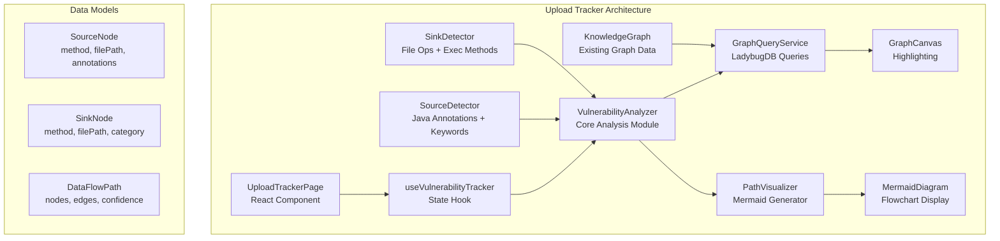

# Upload Vulnerability Tracker - Technical Design

Feature Name: upload-vulnerability-tracker  
Updated: 2026-03-30

## 1. Description

This feature adds a **Upload Vulnerability Data Flow Tracker** to GitNexus Web. It enables security analysts to discover and visualize data flow paths from file upload entry points (sources) to dangerous file handling methods (sinks) within Java web applications.

## 2. Architecture



## 3. Components and Interfaces

### 3.1 UploadTrackerPage Component

**Location:** `src/pages/UploadTrackerPage.tsx` (new)

**Responsibilities:**
- Render the upload tracker UI with configuration panel and visualization tabs
- Manage view state (graph vs mermaid)
- Handle user interactions for filtering and configuration

**Props:**
```typescript
interface UploadTrackerPageProps {
  graph: KnowledgeGraph;
  fileContents: Map<string, string>;
  runQuery: (cypher: string) => Promise<any[]>;
  onNavigateToGraph?: (nodeId: string) => void;
}
```

### 3.2 useVulnerabilityTracker Hook

**Location:** `src/hooks/useVulnerabilityTracker.ts` (new)

**Responsibilities:**
- Manage analysis state and configuration
- Coordinate between detection, path finding, and visualization
- Cache analysis results for performance

**State:**
```typescript
interface VulnerabilityTrackerState {
  sources: SourceNode[];
  sinks: SinkNode[];
  paths: DataFlowPath[];
  selectedPathIndex: number;
  maxPathCount: number;
  maxPathDepth: number;
  sourceFilter: string;
  sinkFilter: string;
  isAnalyzing: boolean;
  viewMode: 'graph' | 'mermaid';
}
```

### 3.3 VulnerabilityAnalyzer

**Location:** `src/core/security/vulnerability-analyzer.ts` (new)

**Responsibilities:**
- Orchestrate source and sink detection
- Execute path discovery queries against LadybugDB
- Aggregate and rank paths by confidence

**Key Methods:**
```typescript
class VulnerabilityAnalyzer {
  // Detect sources from graph nodes
  detectSources(graph: KnowledgeGraph): SourceNode[];
  
  // Detect sinks from graph nodes  
  detectSinks(graph: KnowledgeGraph): SinkNode[];
  
  // Find paths from sources to sinks
  findPaths(params: {
    sources: SourceNode[];
    sinks: SinkNode[];
    maxDepth: number;
    maxPaths: number;
    executeQuery: QueryFn;
  }): Promise<DataFlowPath[]>;
}
```

### 3.4 SourceDetector Module

**Location:** `src/core/security/source-detector.ts` (new)

**Responsibilities:**
- Identify Java web entry points based on annotations
- Match method names against upload-related keywords

**Source Patterns:**
```typescript
const SOURCE_ANNOTATIONS = [
  'RequestMapping', 'GetMapping', 'PostMapping', 
  'PutMapping', 'DeleteMapping', 'PatchMapping'
];

const SOURCE_KEYWORDS = [
  'upload', 'uploadFile', 'doUpload', 'handleUpload',
  'importFile', 'attach', 'postFile', 'fileUpload'
];
```

### 3.5 SinkDetector Module

**Location:** `src/core/security/sink-detector.ts` (new)

**Responsibilities:**
- Identify dangerous file handling and execution methods

**Sink Categories:**
```typescript
enum SinkCategory {
  FILE_WRITE = 'file_write',
  RUNTIME_EXEC = 'runtime_exec',
  DESERIALIZATION = 'deserialization'
}

const SINK_PATTERNS = {
  file_write: [
    'FileOutputStream.write', 'Files.write', 'FileWriter.write',
    'BufferedWriter.write', 'writeBytes', 'transferTo'
  ],
  runtime_exec: [
    'Runtime.exec', 'ProcessBuilder.start', 
    'ClassLoader.defineClass', 'ScriptEngine.eval'
  ],
  deserialization: [
    'ObjectInputStream.readObject', 'XMLDecoder.readObject',
    'Yaml.load', 'JSON.parse'
  ]
};
```

### 3.6 PathVisualizer Module

**Location:** `src/core/security/path-visualizer.ts` (new)

**Responsibilities:**
- Generate Mermaid flowchart from paths
- Generate graph highlighting data

**Mermaid Generation:**
```typescript
class PathVisualizer {
  generateMermaid(paths: DataFlowPath[]): string {
    // Generate flowchart with color-coded nodes
    // Sources: green, Sinks: red, Intermediates: yellow
  }
  
  generateHighlightConfig(paths: DataFlowPath[]): HighlightConfig {
    // Return node/edge highlighting for graph canvas
  }
}
```

## 4. Data Models

### 4.1 SourceNode
```typescript
interface SourceNode {
  id: string;
  methodName: string;
  filePath: string;
  startLine: number;
  endLine: number;
  annotations: string[];
  matchedBy: 'annotation' | 'keyword' | 'both';
}
```

### 4.2 SinkNode
```typescript
interface SinkNode {
  id: string;
  methodName: string;
  filePath: string;
  startLine: number;
  endLine: number;
  category: SinkCategory;
  matchedBy: string;
}
```

### 4.3 DataFlowPath
```typescript
interface DataFlowPath {
  id: string;
  source: SourceNode;
  sink: SinkNode;
  nodes: PathNode[];
  edges: PathEdge[];
  confidence: number;
  depth: number;
}

interface PathNode {
  id: string;
  methodName: string;
  filePath: string;
  type: 'source' | 'intermediate' | 'sink';
}

interface PathEdge {
  sourceId: string;
  targetId: string;
  type: string;
}
```

## 5. Cypher Queries

### 5.1 Find Paths from Source to Sink (BFS)

```cypher
// Find paths from a source method to a sink method
MATCH (source:Method {id: $sourceId})
MATCH (sink:Method {id: $sinkId})
CALL {
  MATCH path = (source)-[:CodeRelation*1..$maxDepth]->(sink)
  WHERE sink.id CONTAINS 'FileOutputStream' 
     OR sink.id CONTAINS 'Runtime.exec'
     OR sink.id CONTAINS 'defineClass'
  RETURN path
  LIMIT 1
}
WITH nodes(path) as pathNodes, relationships(path) as pathRels
RETURN pathNodes, pathRels
```

### 5.2 Find All Sources (Controller Methods)

```cypher
// Find methods with Spring annotations
MATCH (n:Method)
WHERE n.name CONTAINS 'upload' 
   OR n.name CONTAINS 'attach'
   OR n.name CONTAINS 'import'
RETURN n.id AS id, n.name AS name, n.filePath AS filePath
```

### 5.3 Find All Sinks (Dangerous Methods)

```cypher
// Find dangerous file handling methods
MATCH (n:Method)
WHERE n.name CONTAINS 'write'
   OR n.name CONTAINS 'exec'
   OR n.name CONTAINS 'defineClass'
   OR n.name CONTAINS 'readObject'
RETURN n.id AS id, n.name AS name, n.filePath AS filePath
```

## 6. UI Layout

```
┌──────────────────────────────────────────────────────────────────┐
│ Header: [Logo] [Upload Tracker]                    [Settings]    │
├──────────────────────────────────────────────────────────────────┤
│ ┌─────────────────────┐ ┌──────────────────────────────────────┐ │
│ │ Configuration       │ │ Visualization                        │ │
│ │                     │ │                                      │ │
│ │ Sources (12)       │ │  [Graph] [Mermaid]                   │ │
│ │ ├─ uploadFile()   │ │ ┌────────────────────────────────┐  │ │
│ │ ├─ handleUpload()  │ │ │                                │  │ │
│ │ └─ doAttach()      │ │ │   [Graph Canvas / Mermaid]    │  │ │
│ │                     │ │ │                                │  │ │
│ │ Sinks (8)          │ │ │                                │  │ │
│ │ ├─ write()         │ │ │                                │  │ │
│ │ ├─ exec()          │ │ └────────────────────────────────┘  │ │
│ │ └─ defineClass()   │ │                                      │ │
│ │                     │ │ Path 1 of 3                         │ │
│ │ Max Paths: [1 ▼]   │ │ ┌────────────────────────────────┐  │ │
│ │ Max Depth: [5 ▼]   │ │ │ Source: uploadFile()           │  │ │
│ │                     │ │ │  └─► processFile()             │  │ │
│ │ [Analyze Paths]    │ │ │      └─► validate()           │  │ │
│ │                     │ │ │          └─► writeFile() [RED] │  │ │
│ └─────────────────────┘ └──────────────────────────────────────┘ │
├──────────────────────────────────────────────────────────────────┤
│ Status: Found 3 paths from 2 sources to 5 sinks                │
└──────────────────────────────────────────────────────────────────┘
```

## 7. App Integration

### 7.1 View Mode Addition

Add new view mode to `ViewMode` type in `useAppState.tsx`:

```typescript
export type ViewMode = 'onboarding' | 'loading' | 'exploring' | 'upload-tracker';
```

### 7.2 App.tsx Updates

Add navigation to Upload Tracker from Header, and new view mode rendering:

```tsx
// In App.tsx switch statement:
if (viewMode === 'upload-tracker') {
  return <UploadTrackerPage />;
}
```

### 7.3 Header Navigation

Add "Upload Tracker" button in Header component that sets viewMode to 'upload-tracker'.

## 8. Correctness Properties

1. **Source Detection Invariant**: Every detected source MUST be a Method node with either:
   - An annotation matching SOURCE_ANNOTATIONS, OR
   - A name matching SOURCE_KEYWORDS (case-insensitive)

2. **Sink Detection Invariant**: Every detected sink MUST be a Method node with a name matching at least one pattern in SINK_PATTERNS

3. **Path Validity Invariant**: Every returned path MUST:
   - Start with a source node
   - End with a sink node
   - Have each consecutive pair connected by a CALLS relationship
   - Have length <= maxDepth

4. **Visualization Consistency**: The Mermaid view and Graph view MUST display the same path data

## 9. Error Handling

| Scenario | Handling |
|----------|----------|
| No sources found | Display message "No upload entry points found. Try adjusting filters." |
| No sinks found | Display message "No dangerous file handlers found." |
| No paths found | Display message "No data flow paths detected between sources and sinks." |
| Query timeout | Display error with retry option, suggest reducing maxDepth |
| Empty graph | Display message "Load a project first to analyze vulnerabilities." |

## 10. Test Strategy

### Unit Tests
- `source-detector.test.ts`: Test annotation and keyword matching
- `sink-detector.test.ts`: Test sink pattern recognition
- `path-visualizer.test.ts`: Test Mermaid generation and highlighting config
- `vulnerability-analyzer.test.ts`: Test orchestration logic

### Integration Tests
- Full path discovery with sample Java web project
- UI rendering with mocked graph data

## 11. File Structure

```
src/
├── pages/
│   └── UploadTrackerPage.tsx          # New page component
├── components/
│   └── (shared components reused)
├── hooks/
│   └── useVulnerabilityTracker.ts     # New state hook
└── core/
    └── security/
        ├── vulnerability-analyzer.ts   # Main orchestrator
        ├── source-detector.ts         # Source identification
        ├── sink-detector.ts           # Sink identification
        └── path-visualizer.ts         # Mermaid + highlighting
```

## 12. Dependencies

- No new external dependencies required
- Uses existing LadybugDB for graph queries
- Uses existing MermaidDiagram component for rendering
- Uses existing GraphCanvas for highlighting
